# Image_Encoding_and_Decoding_Optimization_on_Arm64

This project is designed for improving the encoding and decoding performance of images on Arm64 platform. Several achievements have been made:  
1.Use AAN（Adaptive Arithmetic Coding for Lossless Image Compression）algorithm to Discrete Cosine Transform(DCT);  
2.Use NEON instructions to enhance both encoding and decoding process, such as DCT, Color Space Transformation, quantilization and Huffman decoding.  

## Theory Explanation

* DCT

The AAN algorithm is a fast Discrete Cosine Transform (DCT) algorithm that involves 13 multiplication operations in a single 8-point DCT computation. However, 8 of these multiplication operations can be offloaded to the quantization factors, resulting in a practical computation of 5 multiplication and 29 addition operations. Essentially, it combines the DCT transformation with subsequent quantization to alleviate the computational complexity of the DCT transformation.

  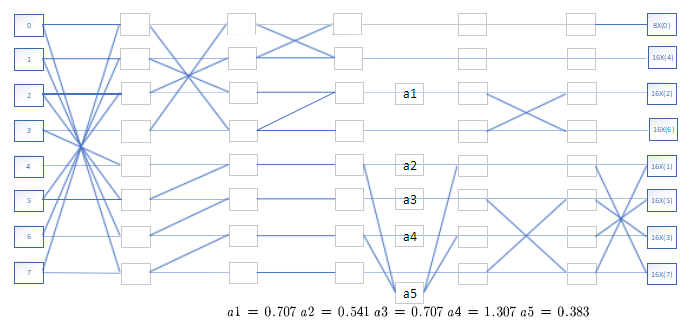

Using NEON instructions for optimization, the data is arranged according to the butterfly operation. Subsequently, 4 sets of 32-bit floating-point data are loaded into the Q registers. After matrix transposition and data extraction operations, 8 vectors, t0 to t7, are obtained and stored in the Q registers. The computations for t0 and t7 correspond to the steps outlined in the AAN algorithm flowchart. Following this, operations can be performed sequentially by invoking functions such as vaddq_f32, vmlq_f32, and others.

  

  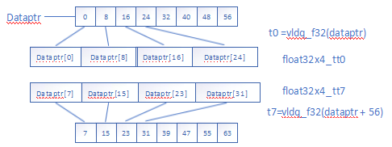

  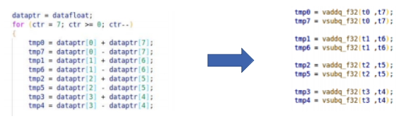

By employing the vtrn instruction in NEON inline functions, the vectors in the registers are first sorted, and then the sorted vectors are written back to the array. The operation involves two steps. Taking t0 to t4 as an example, initially, a vector transpose is performed, treating adjacent channels in a register as a single entity, followed by a matrix transpose operation. The subsequent column processing and row processing follow a similar approach, where the data from the matrix after row processing is taken, vector operations are performed, and the results are stored back in the registers.

  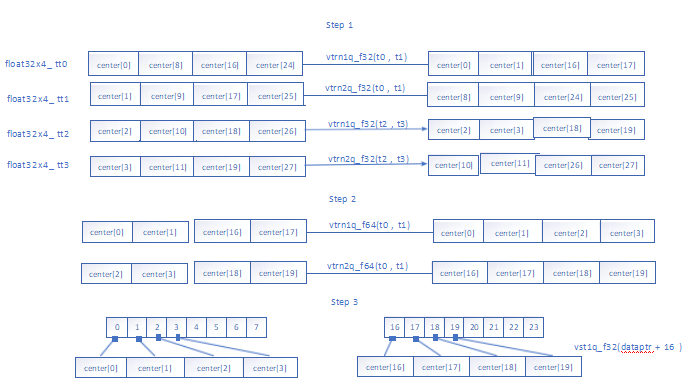

* Color Information Seperation

The first step in processing the minimum data unit of 8x8 is color space transformation. The image's three primary color model data is stored in the RGB_buffer. Using vld3_u8 and vst1_u8 provides a more efficient way to separate the RGB information in the image, facilitating subsequent parallel computations. After separating the color components, each component is then stored in the corresponding buffer for further processing.

  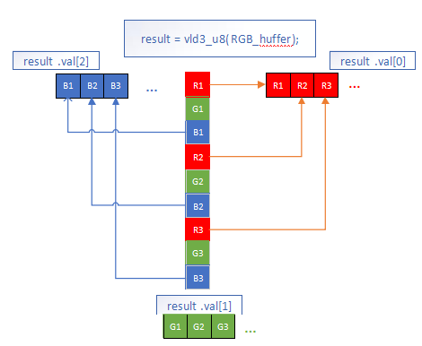

* Color Space Transformation

The output file from the camera is stored in the YUYV packed format, and it needs to be converted to the RGB storage format for subsequent processing. In this project, the vld4q instruction is employed to perform the load operation on the YUYV data. This instruction shares similarities with the vld3 instruction in terms of its underlying concept.

  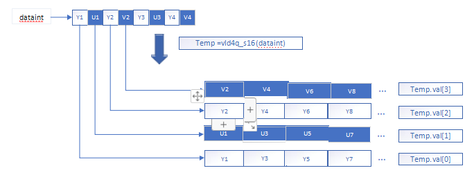

Subsequently, the data in the four registers are combined with each other according to the computational formula. The combination of temp.val[0] and temp.val[3] yields color components r1, r3, r5, r7, etc., and the computed colors are stored in the registers. Next, the vzipq_s16 function is used to rearrange the data in the registers. Similar operations are applied to the G and B components. After completing one operation, the pointer is incremented by 32 for the next iteration.

  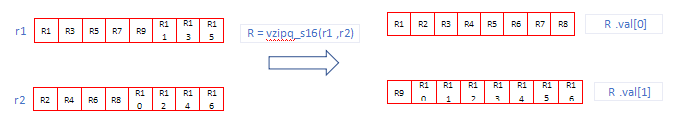

* Huffman decoding

In the reverse Huffman decoding process, the first step involves reading DC Huffman tables, AC Huffman tables, and the DC offset in the form of binary trees. Subsequently, the DC coefficients and AC coefficients in each MCU (Minimum Coded Unit) are processed separately. In each 8x8 image block, elements with indices 1 to 63 represent AC coefficients. For the storage of AC coefficients, it is necessary to store the number of consecutive zeros between the current non-zero coefficient and the previous non-zero coefficient. After counting the number of zeros, the corresponding number of AC coefficients needs to be restored to zero. During this process, the batch storage assignment functionality of the NEON instruction set is utilized. Using the initialized zero vector, values are assigned simultaneously to four 32-bit floating-point vectors, with any remainder after division by 4 individually set to 0.

  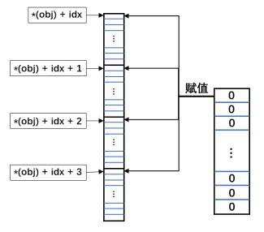

* Inverse quantization decoding

After the Huffman decoding, the 8x8 image block is restored with the top-left element representing the direct current (DC) component, and the remaining 63 elements representing alternating current (AC) components. In the inverse quantization decoding step, each element in the table is multiplied by the corresponding quantization coefficient, requiring a total of 64 multiplication operations. NEON's arithmetic operations are utilized to optimize both the multiplication and bitwise AND operations in this step. Initially, NEON's parallel load and store instructions are employed to efficiently obtain the quantization table and the data table. Subsequently, batch multiplication operations are performed on both sets of data. Four 32-bit float-type elements of the data table are loaded into a Q register, and simultaneously, four sets of 32-bit quantization coefficients are loaded into another Q register after type conversion. Multiplication operations are then executed on the four pairs of data simultaneously, enhancing processing speed.

  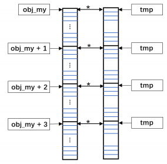

Additionally, when the precision value of the quantization table is 0, it is necessary to truncate the quantization coefficients to the lower 8 bits, specifically using '&0x00FF'. This involves grouping 16-bit quantization coefficients in sets of eight and loading them into NEON registers. Batch bitwise AND operations are then performed in parallel, utilizing the '&0x00FF' operation to truncate each coefficient to the lower 8 bits. This parallel processing enhances the efficiency of the operation.

  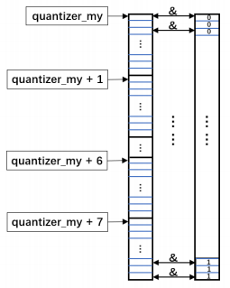

## Requirements

* Ubuntu18.04 LTS
* C compiler: gcc 7.5.0

# Usage

Take the encoding without NEON as example, first cd to directory /Image_Coding_Decoding/Encode/ENCODE/;  
The program ENC.c is the encoding program before NEON optimization, and ENC is the executable file generated from it;  
jglobals stores global variables;  
jtypes contains various segment information settings, custom calculations, data types, structures, and more;  
jtables holds the quantization and Huffman table.

* `gcc -O2  ENC.c -o ENC`
* `./ENC 720p_3.yuv 2.jpeg`

Similar with the decoding.

## Performance

Encode:

  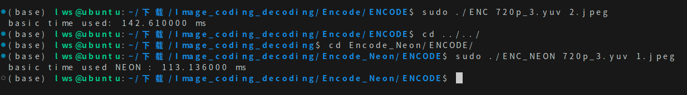

Decode:

  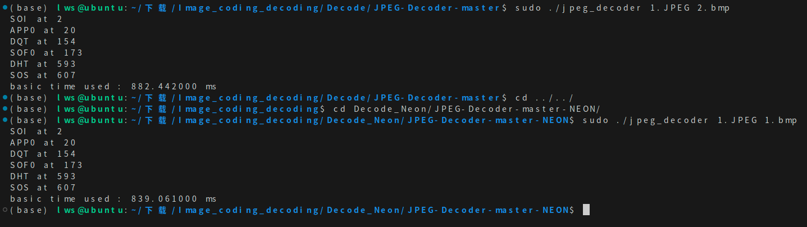

